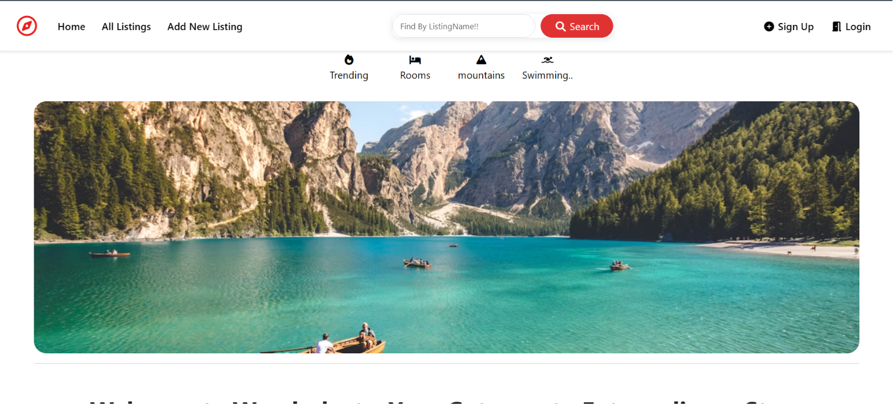

# 🌍 WanderLust - Full Stack Accommodation Booking Platform

WanderLust is a full-stack accommodation booking platform inspired by Airbnb. It allows users to discover unique places to stay, create their own listings, upload property images, leave reviews, and explore destinations through an interactive map.

---

## 🚀 Live Demo

🔗 **Live Website:** https://lnkd.in/dQZd_3vx

---

## 📂 GitHub Repository

💻 **Repository:** https://lnkd.in/dEtP24n4

---

# 📸 Screenshots

> Add screenshots of your application here.

### Home Page


### Listing Details


### Add Listing


---

# ✨ Features

- 🔐 User Authentication & Authorization
- 🏡 Create, Edit & Delete Property Listings
- 📸 Upload Property Images using Cloudinary
- 🗑️ Only Listing Owner can Edit/Delete Listings
- ⭐ Users can Add Reviews
- ❌ Only Review Owner can Delete Reviews
- 🗺️ Interactive Maps using MapTiler API
- 🔍 Search Listings by Name
- 🏷️ Category Filters (Trending, Rooms, Mountains, Swimming Pool)
- 📧 Email Functionality using Nodemailer
- ✅ Client-side Validation
- ✅ Server-side Validation using Joi
- 📱 Responsive UI using Bootstrap
- ☁️ Image Upload using Multer + Cloudinary
- 🧹 Clean MVC Project Structure

---

# 🛠️ Tech Stack

## Frontend

- EJS
- HTML5
- CSS3
- Bootstrap 5
- JavaScript

## Backend

- Node.js
- Express.js

## Database

- MongoDB
- Mongoose

## Authentication

- Passport.js
- Passport Local
- Express Session

## Validation

- Joi
- Client-side JavaScript Validation

## APIs & Services

- MapTiler API
- Cloudinary
- Nodemailer

## Other Packages

- Multer
- Method Override
- Connect Flash
- Connect Mongo
- Dotenv

---

# 📁 Folder Structure

```
WanderLust/
│
├── controllers/
├── models/
├── routes/
├── views/
│   ├── layouts/
│   ├── listings/
│   └── users/
├── public/
│   ├── css/
│   ├── js/
│   └── images/
├── utils/
├── middleware/
├── cloudConfig.js
├── app.js
├── package.json
└── README.md
```

---

# ⚙️ Installation

## Clone Repository

```bash
git clone https://github.com/yourusername/WanderLust.git
```

Move inside project

```bash
cd WanderLust
```

Install Dependencies

```bash
npm install
```

Create a `.env` file

```env
ATLASDB_URL=Your MongoDB Atlas URL

SECRET=Your Session Secret

CLOUD_NAME=Your Cloudinary Cloud Name
CLOUD_API_KEY=Your Cloudinary API Key
CLOUD_API_SECRET=Your Cloudinary API Secret

MAP_TOKEN=Your MapTiler API Key

EMAIL=Your Email
EMAIL_PASS=Your Email Password
```

Start Server

```bash
npm start
```

or

```bash
nodemon app.js
```

Open

```
http://localhost:8080
```

---

# 📚 Major Functionalities

### User Authentication

- Register
- Login
- Logout

### Listings

- Create Listing
- Update Listing
- Delete Listing
- Upload Images
- Search Listings
- Category Filtering

### Reviews

- Add Review
- Delete Review
- Rating System

### Maps

- Automatically shows property location using MapTiler.

### Email

- Send emails using Nodemailer.

---

# 📦 Packages Used

- Express
- Mongoose
- Passport
- Passport-Local-Mongoose
- Joi
- Cloudinary
- Multer
- Multer-Storage-Cloudinary
- Nodemailer
- Express Session
- Connect Flash
- Connect Mongo
- Method Override
- Dotenv

---

# 🎯 Future Improvements

- ❤️ Wishlist Feature
- 💳 Online Payment Integration
- 📅 Booking Calendar
- 💬 Chat between Host and Guest
- 🌙 Dark Mode
- 🔔 Notifications
- 📱 Progressive Web App (PWA)
- 📍 Nearby Places Recommendation

---

# 📖 What I Learned

Through this project I gained practical experience in:

- MVC Architecture
- RESTful Routing
- Authentication & Authorization
- CRUD Operations
- MongoDB & Mongoose
- File Upload using Multer
- Cloudinary Integration
- API Integration
- Session Management
- Server-side Validation with Joi
- Responsive UI Design
- Error Handling
- Deployment

---

# 🤝 Contributing

Contributions, issues, and feature requests are welcome!

Feel free to fork this repository and submit a pull request.

---

# 👨‍💻 Author

**Yug Rana**

- GitHub: https://github.com/YugTRana
- LinkedIn: https://www.linkedin.com/in/YugTRana/

---

# ⭐ Support

If you found this project useful, consider giving it a ⭐ on GitHub!

It helps others discover the project and motivates further development.
